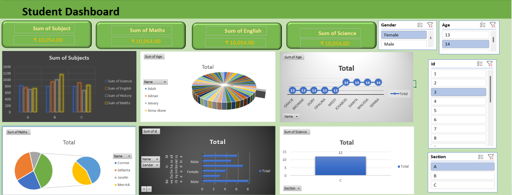

# Excel Student Performance Dashboard

An interactive Excel dashboard developed to analyze student academic performance across subjects, sections, gender, age, and individual students.

## 📊 Project Overview

This dashboard transforms student performance data into interactive charts, KPIs, and filters using Microsoft Excel.

It helps users analyze academic performance and compare results across different subjects and student categories.

## 🛠️ Tools & Technologies

- Microsoft Excel
- Pivot Tables
- Pivot Charts
- Slicers
- Data Analysis
- Data Visualization

## 📈 Dashboard Features

- Subject-wise performance analysis
- Maths performance analysis
- English performance analysis
- Science performance analysis
- Student-level performance
- Gender-wise filtering
- Age-wise filtering
- Section-wise filtering
- Student ID filtering
- Interactive slicers
- KPI cards

## 🖥️ Dashboard Preview

## 📂 Project Files

| File | Description |
|------|-------------|
| `Dashboard/Student-Performance-Dashboard.xlsx` | Interactive Excel dashboard |
| `Images/student-dashboard.png` | Dashboard preview |
| `README.md` | Project documentation |

## 🎯 Project Objective

The objective of this project is to create an interactive Excel-based dashboard that makes student academic performance easier to analyze and understand.

## 💡 Key Insights

The dashboard can be used to:

- Compare subject performance
- Analyze student-level results
- Filter performance by gender and age
- Compare different sections
- Identify performance patterns
- Explore student academic metrics interactively

## 👨‍💻 Author

**Shubham Chaurasia**

B.Tech Computer Science Engineering  
Babu Banarasi Das University, Lucknow
